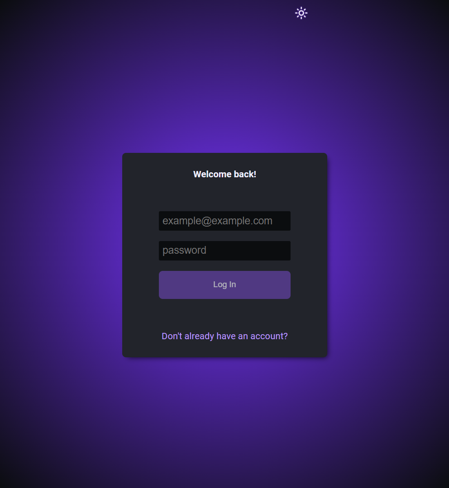
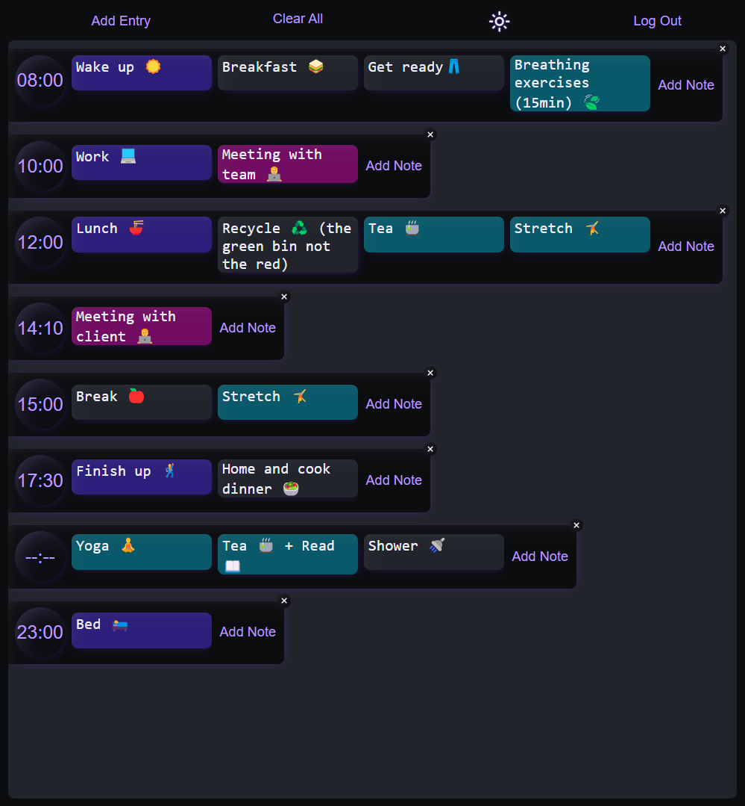
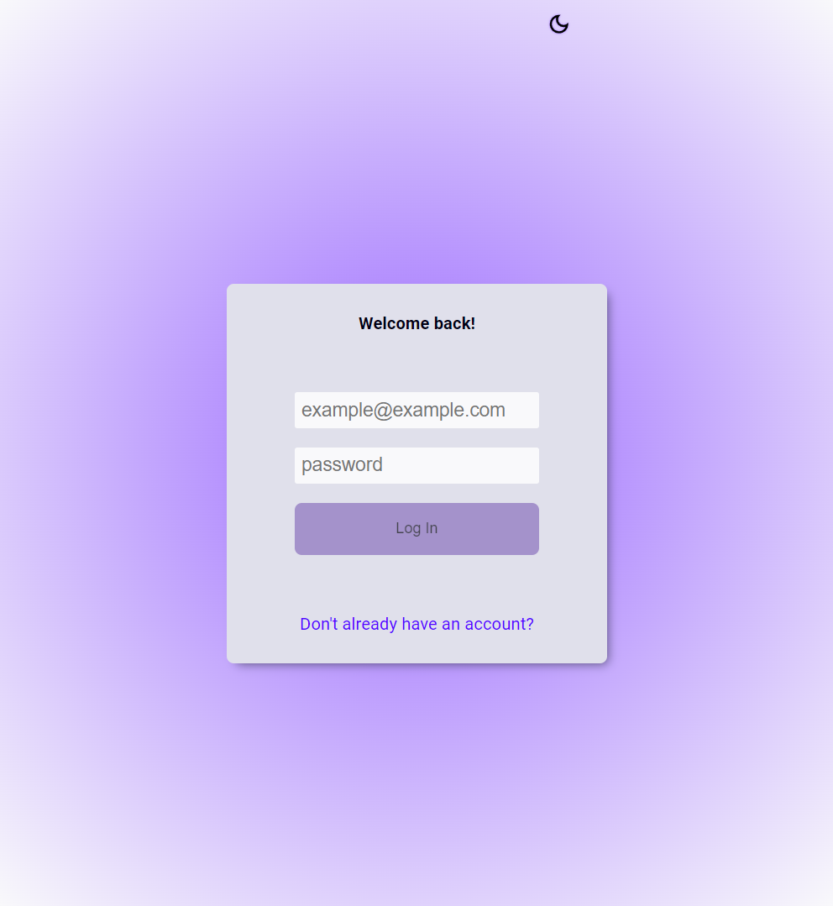
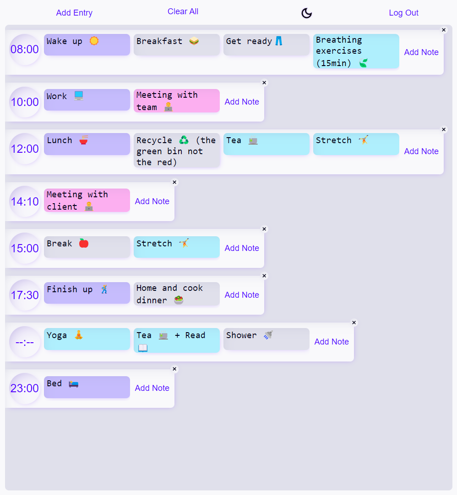

# daily-planner

## What?

A minimalistic full-stack daily planner app 📅✨

## Why?

To demonstrate clean and organized coding practices alongside an understanding of key development concepts. 💡

## Caveats?

> [!NOTE]  
> This project uses a few obviously oversimplified aspects.

For instance, `database.json` does not reflect a secure, scalable approach suitable for production. 🕺

## Screenshots

  
Dark Mode

  
  
  
  

  
Light Mode

  
  
  
  

